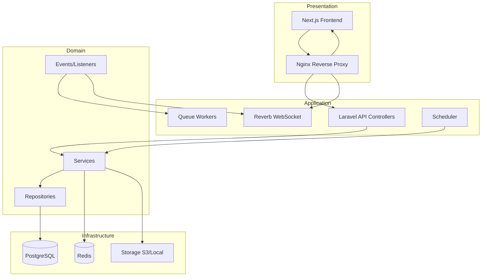
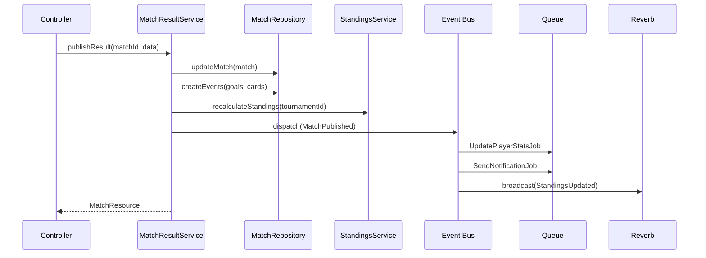

# Kiến trúc hệ thống — Giải Bóng đá Đoàn phường

## Tổng quan

Hệ thống được thiết kế theo **Clean Architecture** với separation of concerns rõ ràng, tuân thủ **SOLID principles**, dễ test và mở rộng.



## Backend — Clean Architecture Layers

```
backend/
├── app/
│   ├── Http/
│   │   ├── Controllers/Api/V1/     # Presentation — thin controllers
│   │   ├── Middleware/              # Auth, RBAC, Rate limit
│   │   ├── Requests/                # Form validation
│   │   └── Resources/               # API response transformers
│   ├── Services/                    # Application — business logic
│   │   ├── TournamentService.php
│   │   ├── StandingsService.php
│   │   ├── FixtureGeneratorService.php
│   │   ├── MatchResultService.php
│   │   └── ImportExportService.php
│   ├── Repositories/                # Infrastructure — data access
│   │   ├── Contracts/
│   │   └── Eloquent/
│   ├── Models/                      # Domain entities (Eloquent)
│   ├── Events/                      # Domain events
│   ├── Listeners/                   # Event handlers
│   ├── Jobs/                        # Async queue jobs
│   └── Policies/                    # Authorization policies
├── database/
│   ├── migrations/
│   └── seeders/
└── routes/api.php
```

### SOLID trong thực tế

| Principle | Áp dụng |
|-----------|---------|
| **S** — Single Responsibility | `StandingsService` chỉ tính BXH; `MatchResultService` chỉ xử lý kết quả |
| **O** — Open/Closed | `FixtureGeneratorInterface` — thêm thể thức mới không sửa code cũ |
| **L** — Liskov Substitution | Repository implementations hoán đổi được (Eloquent ↔ Cache) |
| **I** — Interface Segregation | `TeamRepositoryInterface` tách khỏi `PlayerRepositoryInterface` |
| **D** — Dependency Inversion | Controllers inject Service interfaces, không gọi Eloquent trực tiếp |

### Luồng xử lý: Công bố kết quả trận đấu



## Frontend — Next.js App Router

```
frontend/
├── src/
│   ├── app/                    # App Router pages
│   │   ├── (public)/           # Trang công khai
│   │   ├── admin/              # Trang quản trị
│   │   └── layout.tsx
│   ├── components/
│   │   ├── ui/                 # Design system primitives
│   │   ├── match/              # Match-specific components
│   │   └── admin/              # Admin components
│   ├── lib/
│   │   ├── api/                # API client (fetch wrapper)
│   │   ├── hooks/              # Custom React hooks
│   │   └── websocket/          # Reverb/Pusher client
│   ├── types/                  # TypeScript interfaces
│   └── stores/                 # Zustand state management
```

### Data Flow

1. **Server Components** fetch data cho SEO pages (BXH, tin tức)
2. **Client Components** cho interactive UI (live score, admin forms)
3. **React Query / SWR** cache API responses
4. **WebSocket** push updates cho live score và BXH

## Multi-Tournament Architecture

```
Season (2026)
├── Tournament: Giải Thanh niên
│   ├── Groups: A, B
│   ├── Teams: 16
│   ├── Matches: 48
│   └── Standings: per group
├── Tournament: Giải Thiếu niên
│   └── ...
└── Tournament: Giải Nhi đồng
    └── ...
```

Mọi query nghiệp vụ đều scope theo `tournament_id`. Middleware `SetTournamentContext` resolve tournament từ header hoặc subdomain.

## Caching Strategy

| Data | Cache | TTL |
|------|-------|-----|
| Standings | Redis | Invalidate on publish |
| Public home | Redis | 5 min |
| Settings | Redis | 1 hour |
| News list | Redis | 10 min |
| Player stats | Redis | Invalidate on publish |

## Event-Driven Components

| Event | Listeners/Jobs |
|-------|----------------|
| `MatchPublished` | RecalculateStandings, UpdatePlayerStats, NotifySubscribers, BroadcastWS |
| `TournamentCreated` | GenerateDefaultSettings, AuditLog |
| `EntityDeleted` | MoveToRecycleBin, AuditLog |
| `ImportCompleted` | SendImportReport, AuditLog |

## Scalability

- **Horizontal**: Thêm queue workers, Reverb instances behind nginx
- **Database**: Read replicas cho reporting (role `gbd_readonly`)
- **Storage**: Chuyển sang S3 khi upload > 10GB
- **CDN**: Static assets + `/storage` qua CloudFront/Cloudflare

## Tech Decisions

| Quyết định | Lý do |
|------------|-------|
| PostgreSQL over MySQL | JSONB, full-text search, better constraints |
| Redis over Memcached | Pub/sub, queue, cache unified |
| Reverb over Socket.io | Native Laravel integration |
| UUID over auto-increment | Multi-tenant safe, no ID leak |
| Repository Pattern | Testability, swap data source |
