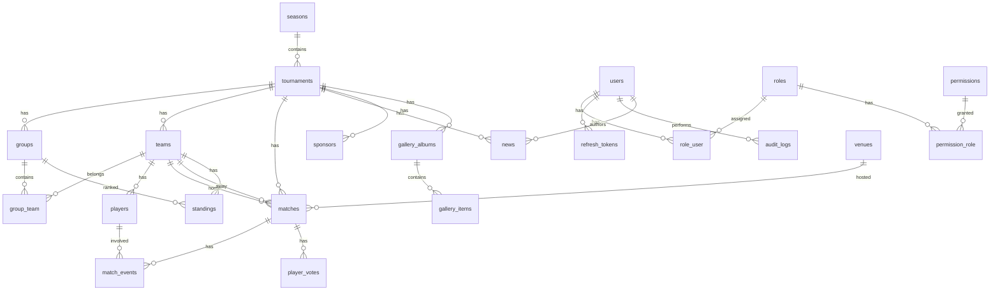

# Database Design — Giải Bóng đá Đoàn phường

> PostgreSQL 16 | UUID primary keys | Soft delete | Audit schema

## ER Diagram



## Bảng chi tiết

### Core — Người dùng

#### `users`
| Cột | Kiểu | Mô tả |
|-----|------|--------|
| id | UUID PK | Khóa chính |
| username | VARCHAR(50) UNIQUE | Tên đăng nhập |
| email | VARCHAR(255) UNIQUE | Email |
| password | VARCHAR(255) | Bcrypt hash |
| full_name | VARCHAR(255) | Họ tên |
| avatar | VARCHAR(500) NULL | URL ảnh đại diện |
| is_active | BOOLEAN DEFAULT true | Trạng thái |
| last_login_at | TIMESTAMP NULL | Lần đăng nhập cuối |
| created_at, updated_at, deleted_at | TIMESTAMP | Laravel timestamps |

#### `roles` / `permissions` / `role_user` / `permission_role`
RBAC chuẩn many-to-many. 8 roles: super_admin, admin, organizer, scorekeeper, mc, media, editor, viewer.

#### `refresh_tokens`
| Cột | Kiểu | Mô tả |
|-----|------|--------|
| token_hash | VARCHAR(255) | SHA-256 hash |
| expires_at | TIMESTAMP | Hết hạn |
| revoked_at | TIMESTAMP NULL | Thu hồi |

### Tournament

#### `seasons`
Mùa giải — nhóm nhiều giải đấu theo năm.

#### `tournaments`
Giải đấu chính. Cột `settings` JSONB lưu cấu hình mở rộng (tiebreak rules, live config...).

| Cột quan trọng | Mô tả |
|----------------|--------|
| format | round_robin, league, knockout, group_knockout, double_round |
| points_win/draw/loss | Điểm thắng/hòa/thua |
| advance_count | Số đội đi tiếp mỗi bảng |
| status | draft, registration, active, completed |

#### `groups` / `group_team`
Bảng đấu và phân bổ đội. `seed` cho thứ tự hạt giống.

### Teams & Players

#### `teams`
| Cột | Mô tả |
|-----|--------|
| tournament_id | FK → tournaments |
| slug | URL-friendly name |
| captain_name, coach_name | Thông tin đội |
| jersey_color | Màu áo mặc định #0066CC |

**Quy tắc xóa**: CASCADE → players, group_team entries.

#### `players`
| Cột | Mô tả |
|-----|--------|
| team_id | FK CASCADE |
| position | GK, DF, MF, FW |
| goals, assists, yellow_cards, red_cards | Thống kê tích lũy |

### Matches

#### `matches`
| Cột | Mô tả |
|-----|--------|
| status | scheduled, live, halftime, finished, postponed, cancelled |
| is_published | Chỉ trận published mới hiện công khai |
| motm_player_id | Man of the Match |

#### `match_events`
Sự kiện chi tiết: goal, own_goal, penalty, assist, yellow_card, red_card, substitution.

#### `standings`
Bảng xếp hạng materialized — recalculate khi publish kết quả.

| Cột | Mô tả |
|-----|--------|
| played, won, drawn, lost | Số trận |
| goals_for, goals_against, goal_diff | Bàn thắng/thua/hiệu số |
| points | Điểm |
| rank | Thứ hạng |
| tiebreak_data | JSONB cho tiebreak |

### Content

#### `news`
SEO fields: seo_title, seo_description, seo_keywords. Rich content HTML/Markdown.

#### `gallery_albums` / `gallery_items`
Album ảnh/video theo giải hoặc chung.

#### `sponsors`
Tier: diamond, gold, silver, partner.

#### `pages`
Trang tĩnh: giới thiệu, điều lệ.

#### `settings`
Key-value store: tên giải, logo, banner, liên hệ, social links...

### System

#### `audit.audit_logs`
| Cột | Mô tả |
|-----|--------|
| action | create, update, delete, login, publish |
| entity_type | team, player, match, news... |
| old_values, new_values | JSONB diff |

#### `recycle_bin`
Snapshot JSONB + expires_at (30 ngày).

## Indexes đề xuất

```sql
CREATE INDEX idx_matches_tournament_date ON matches(tournament_id, match_date);
CREATE INDEX idx_players_team ON players(team_id) WHERE deleted_at IS NULL;
CREATE INDEX idx_news_published ON news(is_published, published_at DESC);
CREATE INDEX idx_standings_group ON standings(group_id, rank);
CREATE INDEX idx_teams_name_trgm ON teams USING gin(name gin_trgm_ops);
CREATE INDEX idx_audit_created ON audit.audit_logs(created_at DESC);
```

## Migration workflow

```bash
php artisan make:migration create_tournaments_table
php artisan migrate
php artisan db:seed --class=TournamentSeeder
```

Xem file tham chiếu: [database/schema-overview.sql](../database/schema-overview.sql)
